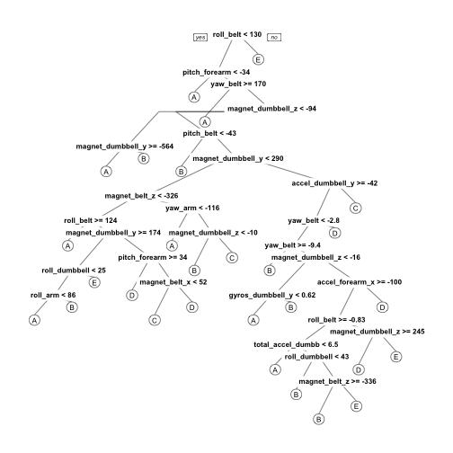
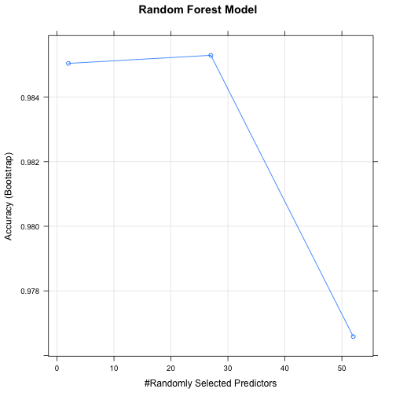
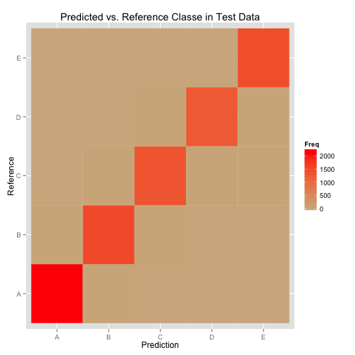

##Background
Six young health participants were asked to perform one set of 10 repetitions of the Unilateral Dumbbell Biceps Curl in five different fashions: exactly according to the specification (Class A), throwing the elbows to the front (Class B), lifting the dumbbell only halfway (Class C), lowering the dumbbell only halfway (Class D) and throwing the hips to the front (Class E). More information on the data set is available [here](http://groupware.les.inf.puc-rio.br/har#ixzz3h1wUeU2j). 

The purpose of this analysis was to fit a model to the training data set to predict the outcome of exercise class (classe) from the available sensor data. This model was then used to predict exercise class for a set of sensor data with unknown exercise class.

An initial exploratory data analysis was done to define the variables that were present in all attempts and some initial models were built. Our final predictive model was a random forest forest that we applied to a test data set and finally the validation data set.

##Raw Data

Input data was gathered from the provided data URLs. CSV data was read in removing standard NA string and #DIV/0 strings.


```r
library(caret)
library(randomForest)
library(rpart)
library(rpart.plot)
library(knitr)
library(kfigr)

if (!file.exists('pml-training.csv')) {
  download.file('https://d396qusza40orc.cloudfront.net/predmachlearn/pml-training.csv','pml-training.csv',method='curl')
}
if (!file.exists('pml-testing.csv')) {
  download.file('https://d396qusza40orc.cloudfront.net/predmachlearn/pml-testing.csv','pml-testing.csv',method='curl')
}

training <- read.csv('pml-training.csv', na.strings=c("NA", "#DIV/0!"))
validation <- read.csv('pml-testing.csv', na.strings=c("NA", "#DIV/0!"))
```

##Data Cleaning

To clean the data we picked the columns that had data cross all training and testing data. These were the raw metrics from the sensors as opposed to some calculated metrics that were only available for certain time aggregating rows in the data. We split the training set into a training and testing set so we could leave the final 20 testing.csv cases as a true validation set.


```r
relevantColumns <- grep('^(roll|pitch|yaw|gyros|accel|magnet|total)_',names(training),value=TRUE)
relevantColumnsTrain <- c("classe", relevantColumns)
relevantColumnsTest <- c("problem_id", relevantColumns)
trainClean <- training[,relevantColumnsTrain]
validClean <- validation[,relevantColumns]

set.seed(123)
inTrain <- createDataPartition(trainClean$classe, p=0.60, list=F)
trainData <- trainClean[inTrain, ]
testData <- trainClean[-inTrain, ]
```

##Exploratory Analysis

A brief exploratory data analysis was done to see if any patterns stood out. This was done since feature selection was difficult on this data set. A feature plot was done but not visualized since it did not provide any useful data and was bulky but it is retained in the code for recording purposes. 

While a decision tree is not going to be the msot accurate model in this case it provides an idea of how our random forest model will work on a tree-by-tree basis. This is visualized in [Figure 1](#treePlot) in the appendix.


```r
#Unused feature plot
#features <- featurePlot(x = trainData[,grep('^(roll|pitch|yaw|total)_',names(training), value=TRUE)],
#  y = trainData$classe,
#  plot = "pairs",
#  auto.key = list(columns = 5))
set.seed(321)
tree <- rpart(classe ~ ., method='class',data=trainData)
```

##Algorithm

The data was analyzed using a random forest algorithm. A random forest is a useful algorithm here because we do not need to manually select important variables which is difficult with this data set. It also handles correlated covariates and outliers well. We chose to use a five-fold cross validation. Because of local limits building this analysis we limited the algorithm to 100 trees this analysis could be improved by using the default of 500 trees.

The accuracy of our model and our randomly selected predictors is shown in [Figure 2](modelPlot). 

Our model is shown below.


```r
set.seed(432)
controls <- trainControl(method="cv", 5)
model <- train(classe ~ ., method='rf', trcontrol=controls, data=trainData, ntree=100)
modelPlot <- plot(model, main='Random Forest Model')
prediction <- predict(model, testData)

cmatrix <- confusionMatrix(testData$classe, prediction)
predictionPlot <- ggplot(data.frame(cmatrix$table), aes(Prediction, Reference)) + geom_tile(aes(fill = Freq),
     colour = "tan") + scale_fill_gradient(low = "tan",
     high = "red") + ggtitle('Predicted vs. Reference Classe in Test Data')

oosAccuracy <- as.numeric(cmatrix$overall['Accuracy'])
oosError <- as.numeric(1-cmatrix$overall['Accuracy'])
answers <- predict(model, validClean)

model
```

```
## Random Forest 
## 
## 11776 samples
##    52 predictor
##     5 classes: 'A', 'B', 'C', 'D', 'E' 
## 
## No pre-processing
## Resampling: Bootstrapped (25 reps) 
## Summary of sample sizes: 11776, 11776, 11776, 11776, 11776, 11776, ... 
## Resampling results across tuning parameters:
## 
##   mtry  Accuracy   Kappa      Accuracy SD  Kappa SD   
##    2    0.9850450  0.9810776  0.002556836  0.003239995
##   27    0.9852953  0.9813967  0.002226454  0.002822843
##   52    0.9765815  0.9703742  0.005652090  0.007153534
## 
## Accuracy was used to select the optimal model using  the largest value.
## The final value used for the model was mtry = 27.
```

In random forests, there is no need for cross-validation or a separate test set to get an unbiased estimate of the test set error. Our Out-Of-Sample (OOS) accuracy is **99.04**. Our OOS error is 1 - accuracy or **0.96**. As we can see our model is very robust and has an extremely high OOS accuracy.

##Conclusion
Our random forest was an excellent model for this data set. We got extremely high accuracy and low out-of-sample error and correctly identified all 20 items in our validation set. We were able to clearly distinguish between the five exercise movements.

##Appendix

###Figure 1

<a name="treePlot"></a> 

###Figure 2
<a name="modelPlot"></a> 

###Figure 3
<a name="predictionPlot"></a> 
